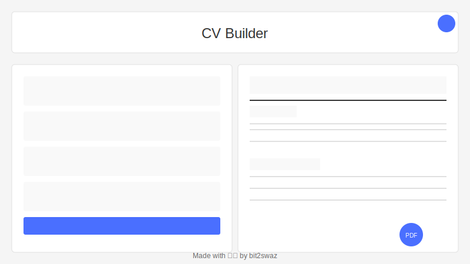

# CV Builder

A professional, interactive CV/resume builder application built with React. Create, edit, and download your resume in minutes with a real-time preview.



## 🌟 Live Demo

Check out the live demo: [CV Builder Live Demo](https://your-live-demo-url-here.com)

## ✨ Features

- **Live Preview**: Real-time resume rendering as you type
- **Multiple Sections**: General info, education, and work experience
- **Dark/Light Theme**: Toggle between dark and light modes
- **PDF Export**: Download your resume as a PDF with one click
- **Local Storage**: Your data is automatically saved in your browser
- **Responsive Design**: Works on desktop, tablet, and mobile devices
- **Professional Template**: Clean, minimalist design that looks great when printed

## 🛠️ Technologies Used

- React (Hooks, Context API)
- CSS (Custom styling with variables)
- LocalStorage API
- React-to-Print for PDF export
- Vite for fast development and building

## 🚀 Getting Started

### Prerequisites

- Node.js (v14+)
- npm or yarn

### Installation

1. Clone the repository
   ```bash
   git clone https://github.com/bit2swaz/cv-application.git
   cd cv-application
   ```

2. Install dependencies
   ```bash
   npm install
   # or
   yarn
   ```

3. Start the development server
   ```bash
   npm run dev
   # or
   yarn dev
   ```

4. Open your browser and navigate to `http://localhost:5173`

## 📝 Usage

1. Fill in your personal information in the left sidebar
2. Add your education and work experience entries
3. See the changes instantly reflected in the right preview pane
4. Toggle between light and dark theme using the button in the top-right corner
5. When you're satisfied with your resume, click "Download PDF" to save it

## 🤝 Contributing

Contributions, issues, and feature requests are welcome! Feel free to check the [issues page](https://github.com/bit2swaz/cv-application/issues).

## 👤 Author

**bit2swaz**

- GitHub: [@bit2swaz](https://github.com/bit2swaz)

## 📋 License

This project is [MIT](LICENSE) licensed.

---

Made with ❤️ by [bit2swaz](https://github.com/bit2swaz)
